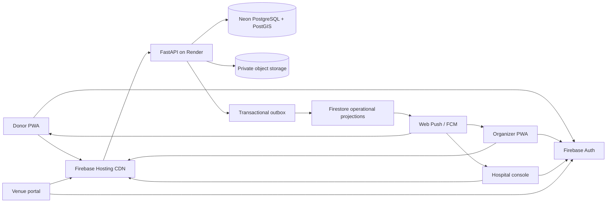

# RaktFlow architecture

## 1. Architectural intent

RaktFlow coordinates logistics; it does not make clinical decisions. The design emphasizes five invariants:

1. **No unverified donor broadcast.** A request must pass an authorized human verification gate before alerts can leave the hospital workflow.
2. **Least-noise dispatch.** Rare alerts start with 3–5 eligible opted-in donors within 15 km and expand only after the response window fails.
3. **Resolution revokes attention.** Receiving-desk confirmation moves a request to `RESOLVED`; pending alerts are then withdrawn.
4. **Intermittent connectivity must not lose drive intake.** Each write is idempotent, locally queued, and batch-replayed.
5. **Clinical control remains external to automation.** RaktFlow never determines blood compatibility, releases units, or clears a donor for collection by itself.

## 2. System context



### Store ownership

- **PostgreSQL is authoritative** for user provisioning, request state, eligibility metadata, drives, check-ins, dispatch, and audit.
- **Private object storage is authoritative** for requisition document bytes. PostgreSQL stores only the opaque object key and SHA-256 digest.
- **Firestore is a projection**, never the system of record. It contains recipient-scoped operational events without PHI.
- **IndexedDB is a temporary device queue** for donor pass material and offline check-ins.

## 3. Request and notification flow

```mermaid
sequenceDiagram
    actor HP as Hospital practitioner
    participant API as FastAPI
    participant PG as PostgreSQL
    participant RV as Authorized reviewer
    participant OW as Outbox worker
    participant FS as Firestore / Push
    actor DN as Matched donor

    HP->>API: Upload private requisition + create request
    API->>PG: PENDING request + document digest + audit
    RV->>API: Confirm physician, component, reason code
    API->>PG: VERIFIED + outbox event (one transaction)
    alt rare phenotype
        API->>PG: ST_DWithin 15 km; select 3–5 opted-in eligible donors
        API->>PG: donor_alert rows with 10-minute deadline
    end
    OW->>PG: Lock pending outbox rows
    OW->>FS: Recipient-scoped operational event
    FS-->>DN: Silent push pager
    DN->>API: Accept or decline
    alt fewer than 2 accept after 10 minutes
        API->>PG: Expand once to 30 km; exclude prior contacts
    end
    HP->>API: Log receiving event
    API->>PG: RESOLVED + revoke-alert event + audit
    FS-->>DN: Request resolved; alert withdrawn
```

## 4. State machines

### Blood request

```text
PENDING ──authorized verify──> VERIFIED ──receiving event──> RESOLVED
   │                              │
   ├──review rejection──> REJECTED│
   └──expiry────────────> EXPIRED └──expiry──────────────> EXPIRED
```

Forbidden transitions are rejected with HTTP `409`. Verification requires a reviewer, timestamp, physician-registration confirmation, component confirmation, and reason code. OCR may propose fields but cannot change state.

### Rare donor alert

```text
PENDING ──donor response──> ACCEPTED | DECLINED
   └──deadline or request closure──> EXPIRED
```

One donor can receive at most one alert per request. Tier 2 cannot run before the Tier 1 deadline, after two acceptances, or more than once.

### PPH dispatch

```text
ACTIVATED -> ACKNOWLEDGED -> UNITS_RELEASED -> EN_ROUTE -> DELIVERED
     └──────────────────── authorized cancellation ─────────> CANCELLED
```

The target arrival is two hours from activation. This is an operational target, not a clinical guarantee.

## 5. Offline check-in design

1. The organizer scans a rotating donor pass.
2. The UI creates an idempotency key before attempting the network write.
3. Workbox tries `POST /api/v1/checkins`.
4. If unavailable, the request enters the `sync-donor-checkins` Background Sync queue; the companion IndexedDB design uses database `raktflow_offline_scans` and object store `pending_checkins`.
5. Restoration triggers a single bounded batch to `/api/v1/checkins/batch`.
6. PostgreSQL uses `ON CONFLICT DO NOTHING` on `idempotency_key`; replaying the same scan is safe.
7. The API returns accepted and duplicate counts and appends one audit event.

Production hardening should encrypt sensitive local payload fields with a non-exportable WebCrypto key, enforce queue expiry, and provide an explicit “clear this shared device” control.

## 6. Connection strategy

The API uses Neon's **pooled PostgreSQL endpoint** through SQLAlchemy async + asyncpg:

- `pool_size <= 5`
- `max_overflow = 0`
- `pool_pre_ping = true`
- `pool_recycle = 300`
- asyncpg statement cache disabled for transaction-pooler compatibility

Neon's HTTP driver is an alternative client path; it is not combined with asyncpg. Short transactions, bounded query pages, partial indexes, and GiST spatial indexes are more important than a large connection pool.

## 7. Specialized engines

### Rare standby grid

- Preconditions: request is `VERIFIED`, urgency is `RARE_STANDBY`, phenotype is explicit, request is unexpired.
- Query: `ST_DWithin(donor.location, request.location, radius_m)` followed by `ST_Distance` ordering.
- Filters: opted in, eligibility window current, phenotype match, no prior alert for the request.
- Tier 1: 15 km, 3–5 donors, 10 minutes.
- Tier 2: 30 km, one expansion, only if fewer than two accept.
- Coordinates are used server-side and never placed in donor notification documents.

### Anti-noise verification

- Document upload returns an opaque object key and content digest.
- Validation assistance can check file integrity, expected fields, and known institutional metadata.
- Only an authorized human reviewer can set `VERIFIED` or `REJECTED`.
- The request expires in 6–12 hours. A scheduled job calls `expire_stale_requests()` and publishes revocation events.

### Platelet pipeline

- Candidates require current apheresis eligibility, suitable vein-access assessment, availability, and at least 14 days since the last apheresis event.
- A deterministic least-loaded allocator places candidates into Group A/B/C windows over three days.
- The scheduler creates offers, not appointments or eligibility decisions.
- Inventory disposition must use actual collection/expiry timestamps supplied by the blood bank.

### PPH bridge

- Requires a `VERIFIED` `CRITICAL_PPH` request and explicit clinical authorization confirmation.
- Creates one dispatch per request, target arrival +2 hours, and an append-only audit event.
- Alerts operational parties through the outbox.
- Universal-donor logic is never used as an automated compatibility order; the blood bank and clinical team control release and transfusion.

## 8. Frontend state model

The prototype keeps demo state in memory/local storage. Production state should be divided into:

| State | Owner | Strategy |
|---|---|---|
| Auth session and role claims | Firebase Auth | Observer; force token refresh after provisioning |
| Authoritative transactions | FastAPI/PostgreSQL | Request cache with explicit invalidation |
| Emergency operational events | Firestore projection | Recipient-scoped snapshot listener |
| Pending offline writes | Workbox + IndexedDB | Durable queue with replay and TTL |
| Theme and benign preferences | Local storage | Local only |
| Forms and modal state | Page controller | Ephemeral; never local-store clinical documents |

## 9. Reliability boundaries

The free-tier topology can support a prototype or controlled pilot, but not a guaranteed emergency service:

- Render may cold-start or change inactivity policies.
- Scheduled GitHub Actions are subject to queue delay and are not a health guarantee.
- Neon can autosuspend and enforces storage/compute quotas.
- Firebase quotas and product terms can change.
- One region is a failure domain.

Before clinical use, adopt paid always-on compute, managed secrets, private object storage, PITR backups, queue workers, multi-channel paging, observability, load tests, runbooks, and a contractual availability target.
